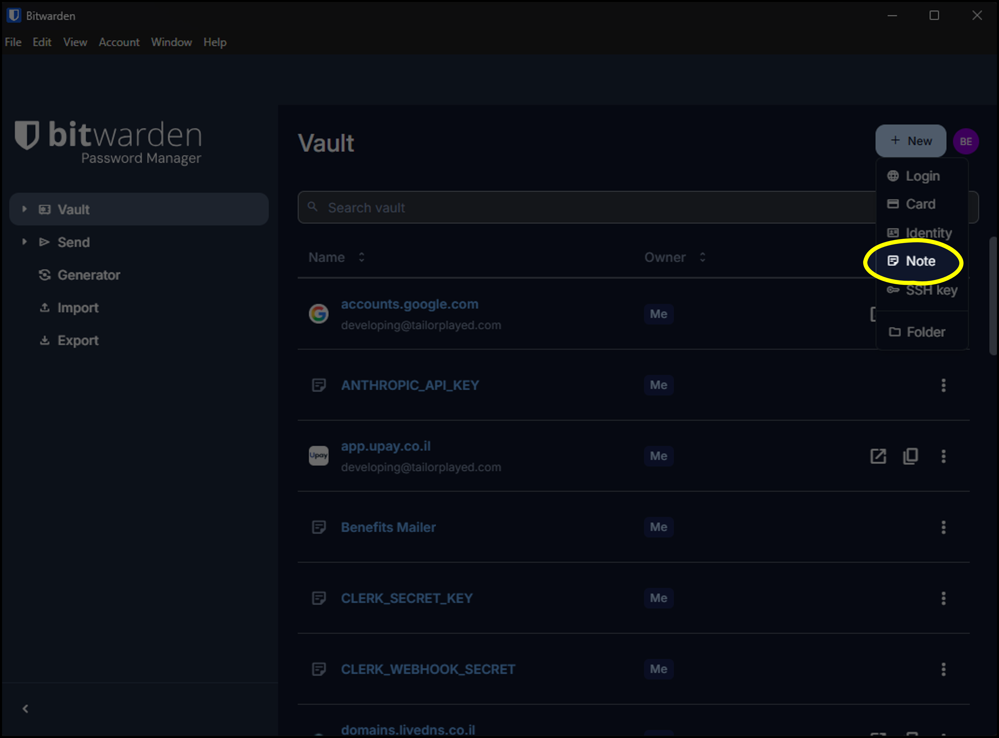
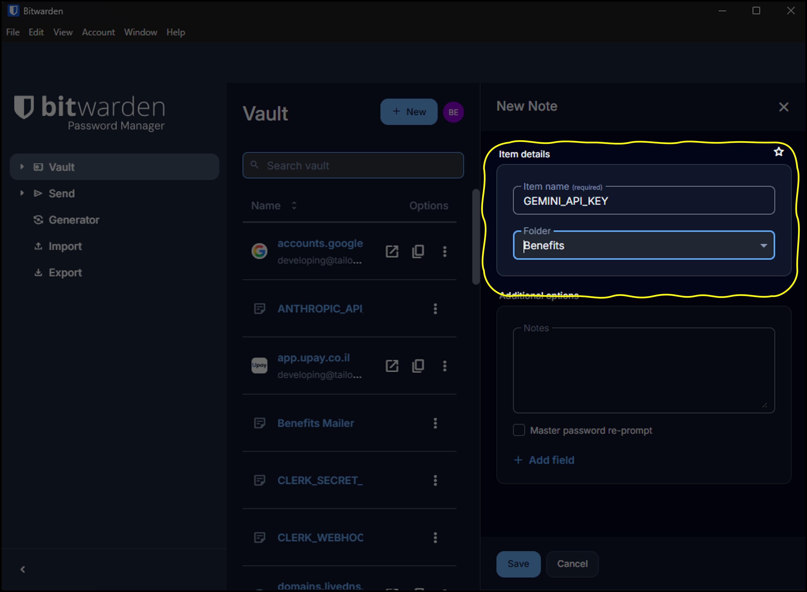
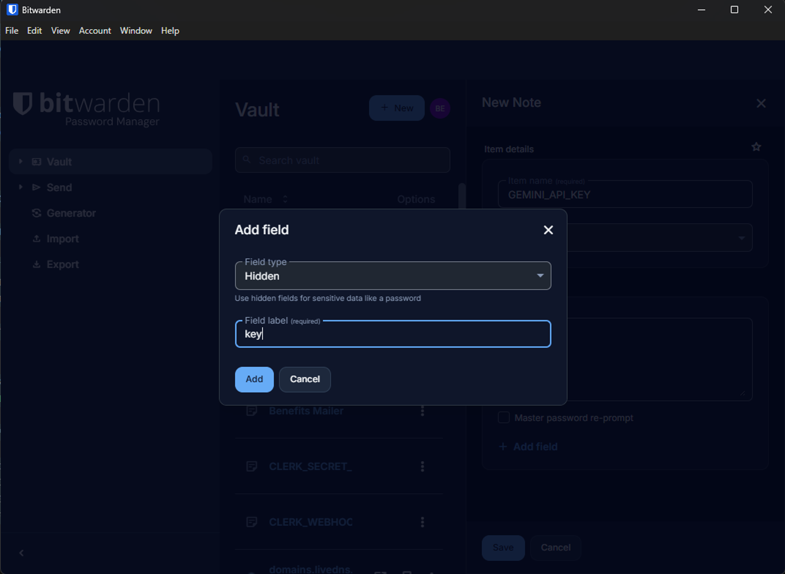
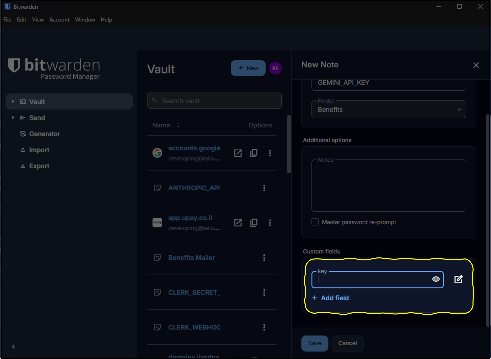
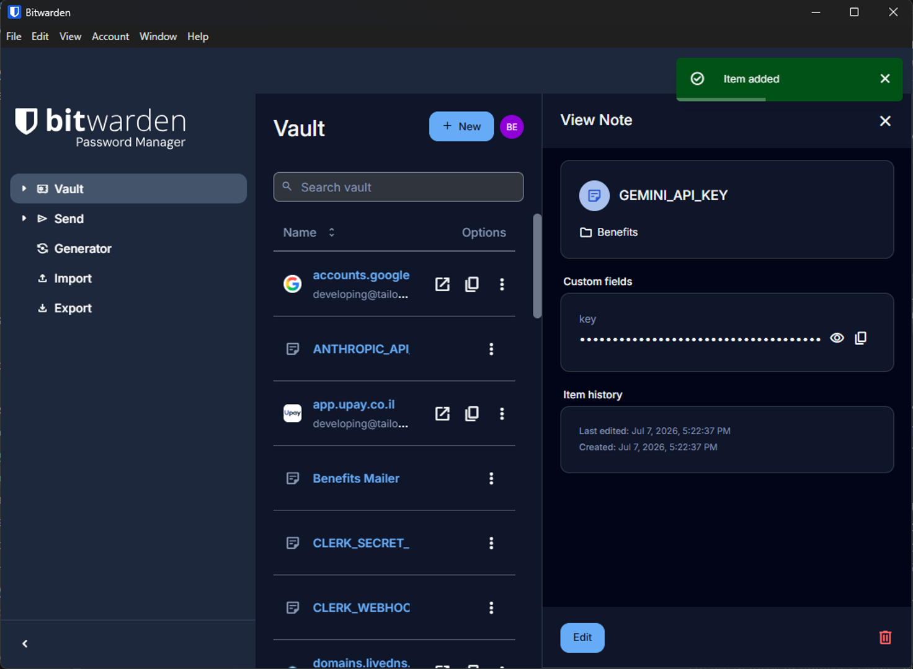

# בבית — מפתח, כסף וכספת

## מה עושים כאן

זו ההכנה הראשונה לשיעור 5 — המפגש האחרון, שבו כל מה שבניתם בקורס מתחבר. בכיתה תבנו מנוע שמדבר עם Gemini ויודע לתמלל, לנתח, לייצר תמונות, וידאו, דיבור ואפילו מוזיקה. בשביל שהמנוע הזה יעבוד, מגיעים לשיעור עם שלושה דברים מוכנים: כספת ששומרת על סודות, מפתח API אמיתי, וקצת כסף טעון מראש בחשבון.

והסדר כאן מכוון: קודם מקימים את הכספת, ורק אחר-כך יוצרים את המפתח — כדי שלרגע אחד המפתח שלכם לא יישב חשוף בצד.

> **נתקעתם? שאלו את קלוד.** אם משהו לא ברור, או שמסך אצלכם נראה אחרת מבהוראות, צלמו מסך, הדביקו לקלוד, ובקשו שיסביר: "מה אני רואה כאן ואיך אני ממשיך?". זה הכי מהיר, וקלוד יעבור איתכם צעד-צעד.

### מה שאתם צריכים קודם

- חשבון Google פעיל (Gmail) — איתו נכנסים ל-Google AI Studio.
- כרטיס אשראי — לטעינת הקרדיט (נסביר בפנים בדיוק כמה ולמה).
- דפדפן מודרני והרשאה להתקין תוכנה על המחשב — בשביל Bitwarden.
- הלינק לאתר ניתוח-ה-PDF וקובץ ה-PDF לתרגול — שניהם מחכים בעמוד הזה, נגיע אליהם בסוף.

---

## 🎬 הסרטון של היחידה

<!-- video: TBD -->
> הסרטון בהכנה ויעלה כאן בקרוב. הכלל שלנו: קודם צופים, ואז מבצעים — אבל כל הצעדים כתובים כאן במלואם, אז אפשר להתחיל גם מהכתוב.

הסרטון עובר על כל המסלול: מה זה מפתח API ולמה הוא כרטיס אשראי דיגיטלי, הקמת הכספת, יצירת מפתח אמיתי, טעינת הקרדיט, ובדיקה על כלי אמיתי.

---

## רגע, מה זה בכלל מפתח API?

מפתח API הוא רצף ארוך של אותיות ומספרים שמאפשר לכלי אחד לדבר עם שירות אחר בשמכם — בלי שם משתמש וסיסמה. הוא נראה בערך כך (זו דוגמה, לא מפתח אמיתי):

```text
AIzaSyD-EXAMPLE-key-1a2b3c4d5e6f7g8h9i
```

ולמה מתייחסים אליו ברצינות? כי מפתח API הוא לא סיסמה — הוא **כרטיס אשראי דיגיטלי**. מי שמחזיק בו יכול לפעול בשמכם ולחייב אתכם, בלי זיהוי פנים ובלי קוד לנייד. המערכת בצד השני מאמינה למחרוזת באופן עיוור. לכן לא משאירים אותו חשוף בקובץ טקסט ולא שולחים בוואטסאפ — שומרים אותו בכספת.

ובגלל שזה כל כך חשוב, אנחנו בונים את הכספת **לפני** שניצור את המפתח הראשון.

---

## תרגיל 1 — מקימים את הכספת, ומתאמנים על רשומת דמו

Bitwarden הוא מנהל סיסמאות חינמי עם **הצפנת אפס-ידע**: כל מה שנכנס לכספת מוצפן על המחשב שלכם עוד לפני שהוא עולה לענן, כך שגם עובדי Bitwarden וגם האקר שיפרוץ לשרתים שלהם לא יכולים לקרוא את מה ששמרתם. רק אתם, עם סיסמת המאסטר.

מה עושים:

1. נכנסים ל-bitwarden.com ופותחים חשבון חינמי. **סיסמת המאסטר** היא הסיסמה היחידה שתצטרכו לזכור — בחרו חזקה וייחודית. שימו לב: אם תשכחו אותה, אין שחזור (זה המחיר של אפס-ידע), אז בחרו משהו שתזכרו.
2. מתקינים את אפליקציית ה-Desktop ואת תוסף הדפדפן מאותו אתר. הכספת מסתנכרנת בין שניהם.
3. עכשיו מתאמנים על בניית רשומה — עם מפתח דמו, לא אמיתי. בונים אותה בדיוק בשיטה שבה נשמור בהמשך את המפתח האמיתי: הסוד יושב ב**שדה מוסתר (Hidden)** — הוא מוצג בנקודות, ומעתיקים אותו בלחיצה אחת, בלי שיישב חשוף על המסך. בצילומים למטה רואים דוגמה עם המפתח האמיתי (GEMINI_API_KEY); אתם עוברים על אותם הצעדים בדיוק, רק עם מפתח הדמו.

   פותחים פריט חדש (New) ובוחרים **Note** — לא Login. Login נועד לשם משתמש וסיסמה; מפתח API הוא סוד עצמאי.

   

   נותנים **שם ברור** שאומר איזה מפתח ולאיזה צורך, ובוחרים תיקייה. שם טוב הוא כזה שבעוד חצי שנה תדעו מיד למה הוא משמש.

   

   לוחצים **Add field**, בוחרים סוג **Hidden**, ונותנים לשדה את התווית key. השדה המוסתר הוא זה שמחזיק את הסוד עצמו.

   

   מדביקים את המפתח לתוך השדה המוסתר. לתרגול, הדביקו את מפתח הדמו:

```text
DEMO-KEY-1234-THIS-IS-NOT-REAL
```

   

   שומרים (Save). הרשומה נשמרה, והמפתח מופיע מוסתר בנקודות — בדיוק כמו שרוצים.

   
4. ועכשיו — **מוחקים את רשומת הדמו.** פותחים את הרשומה ובוחרים מחיקה. זה כל התרגול: יצרתם, שמרתם, מחקתם. הכספת עובדת ואתם שולטים בה.

מה השגתם: כספת מוצפנת מותקנת ומסונכרנת, ואתם יודעים ליצור רשומת מפתח מסודרת — ולמחוק אותה.

בדיקה עצמית:
- Bitwarden מותקן גם כאפליקציה וגם כתוסף בדפדפן, ואותו חשבון פתוח בשניהם.
- יצרתם רשומת דמו עם שם ושדה key מוסתר — ומחקתם אותה.

---

## תרגיל 2 — יוצרים מפתח אמיתי, ושומרים אותו ישר בכספת

עכשיו, כשיש כספת, יוצרים את המפתח האמיתי — והוא עובר ישירות מהמסך של Google אל הרשומה שלו. בלי תחנת ביניים.

מה עושים:

1. נכנסים ל-Google AI Studio בכתובת aistudio.google.com ומתחברים עם חשבון ה-Google שלכם. אין הרשמה נפרדת.
2. בתפריט הצד לוחצים **Get API key** (או נכנסים ישירות ל-aistudio.google.com/api-keys).
3. לוחצים **Create API key**, בוחרים פרויקט קיים או נותנים לו ליצור חדש, ולוחצים **Create key**.
4. המפתח מוצג על המסך **פעם אחת**. הוא מתחיל ב-AIza. מעתיקים אותו — ועוברים ישר ל-Bitwarden. (נסגר החלון לפני שהעתקתם? לא נורא — יוצרים מפתח חדש, אין מגבלה.)
5. ב-Bitwarden בונים לו רשומה בדיוק כמו שהתאמנתם: Note, שם ברור, ושדה Hidden בשם key שמחזיק את המפתח. לשם אפשר להעתיק:

```text
Gemini API Key - Benefits Course
```

6. חוזרים ל-AI Studio ולוחצים על **Restrict to Gemini API** — לחיצה אחת שנועלת את המפתח לשירות אחד בלבד. גם אם הוא ידלוף, אי אפשר יהיה להשתמש בו לשום דבר אחר.

מה השגתם: מפתח Gemini אמיתי, מוגבל, שמור בכספת ברשומה מסודרת — ומעולם לא ישב חשוף בצד.

בדיקה עצמית:
- הרשומה ב-Bitwarden מכילה שם ברור ושדה key מוסתר עם המפתח.
- המפתח מסומן ב-AI Studio כמוגבל ל-Gemini API.

---

## תרגיל 3 — טוענים כסף (ולמה זה דווקא הצעד הבטוח)

נאמר את זה ישר: הקורס בונה את כל תרגילי המדיה — תמונות, וידאו, דיבור, מוזיקה — על Gemini בתשלום. במסלול החינמי כל אלה פשוט לא זמינים. טעינה חד-פעמית של **בסביבות 15 דולר** מכסה את כל תרגילי הקורס בשפע: ניסיון מלא של וידאו עם דיבור ומוזיקה עולה בסביבות חצי דולר, ועשרות תמונות עולות דולרים בודדים. (מי שירצה, בהמשך, יוכל לשדרג בבית גם לעבודה עם קלוד — נדבר על זה אחרי השיעור.)

ויש כאן שתי בשורות טובות שכדאי להבין לפני שמקלידים מספר כרטיס:

- **הכסף הטעון הוא תקרת-ההוצאה שלכם.** ‏Google עברה למודל של קרדיט מראש: קונים סכום מוגדר, והשימוש יורד ממנו. אי אפשר לחייב אתכם מעבר למה שטענתם — עקרון ה-Hard Limit, מובנה במערכת.
- **בתשלום, הפרטיות שלכם משתדרגת.** במסלול החינמי התוכן שאתם שולחים עשוי לשמש לשיפור המודלים של Google. במסלול בתשלום — לא. מה שתשלחו למנוע שלכם נשאר שלכם.

מה עושים:

1. ב-Google AI Studio פותחים את עמוד ה-**Billing** (בתפריט הצד).
2. לוחצים על הגדרת התשלום, ובוחרים את הפרויקט שבו יצרתם את המפתח.
3. בוחרים סכום לטעינה — המינימום הוא 10 דולר; אנחנו טוענים **בסביבות 15 דולר** — ומשלימים את התשלום בכרטיס.
4. **לא מפעילים Auto-reload** (טעינה אוטומטית מחדש). בלעדיו, מה שטענתם הוא הגבול — וזה מה שאנחנו רוצים.
5. מוודאים שהחשבון עבר לשכבה בתשלום: בעמוד ה-Billing או ה-Projects הפרויקט כבר לא מסומן Free.

> **אצלכם זה נראה אחרת?** חשבונות שהוגדרו לפני מרץ 2026 נמצאים לפעמים במסלול חיוב-חודשי (מחייבים את הכרטיס בסוף החודש לפי שימוש) במקום קרדיט מראש. אם זה המצב — חברו את הכרטיס, וחפשו בהגדרות ה-Billing את אפשרות ההתראה או מגבלת-התקציב, והגדירו אותה על 15 דולר. אותה תוצאה: תקרה מוגדרת מראש.

מה השגתם: חשבון Gemini בתשלום עם קרדיט טעון, תקרת-הוצאה מובנית, ופרטיות מלאה על התוכן. המפתח שלכם עכשיו פותח את כל עולם המדיה — וזה מה שנדליק בכיתה.

בדיקה עצמית:
- הקרדיט מופיע בעמוד ה-Billing.
- ‏Auto-reload כבוי (או, במסלול חיוב-חודשי: הוגדרה מגבלה או התראה של 15 דולר).

---

## תרגיל 4 — בודקים שהמפתח באמת עובד

הרגע שסוגר את הלולאה: יצרתם מפתח, שמרתם אותו — עכשיו שולפים ומשתמשים. הכנו לכם אתר קטן שמנתח קובצי PDF, והוא לא עושה כלום עד שמזינים לו מפתח — בכוונה. הכנו גם את קובץ ה-PDF לתרגול: מסמך קצר על מפתחות API והסיפור שלהם. תנתחו איתו את מה שהרגע למדתם.

מה עושים:

1. מורידים את [קובץ ה-PDF לתרגול](api-keys-story.pdf), ופותחים את [אתר הבדיקה](https://benefits-il.dev/pdf-analyzer/).
2. פותחים את Bitwarden, מוצאים את הרשומה, ומעתיקים את המפתח.
3. מדביקים את המפתח בשדה באתר.
4. גוררים פנימה את קובץ ה-PDF ולוחצים על כפתור הניתוח.

תוך כמה שניות האתר שולח את הקובץ ל-Gemini עם המפתח שלכם ומחזיר ניתוח. **המפתח שלכם הדליק כלי אמיתי.** שימו לב מה קרה כאן: שליפה מהכספת ← שימוש בכלי ← תוצאה. זו בדיוק התנועה שתעשו בשיעור 5, רק שבכיתה הכלי יהיה מנוע שאתם בונים בעצמכם.

מילה על אמון: כשמדביקים מפתח בכלי, השאלה הנכונה היא תמיד "איך הכלי שומר את המפתח?". האתר הזה שומר את המפתח בדפדפן שלכם בלבד ושולח אותו ישירות ל-Google — לא לשום שרת אחר. זה דפוס לגיטימי כשסומכים על מי שבנה את הכלי וכשהמפתח מוגבל — שני תנאים שדאגנו להם.

בדיקה עצמית:
- האתר החזיר ניתוח — סימן שהמפתח תקין ומוגבל נכון.

---

## הכללים שנשארים איתכם

- **המפתח לא מופיע לעולם:** לא בקוד או ב-GitHub, לא בוואטסאפ, לא במייל, לא בכלי שלא בוטחים בו.
- **צריך להעביר מפתח למישהו?** ‏Bitwarden Send — קישור מוצפן חד-פעמי עם השמדה עצמית. לא בצ'אט.
- **מפתח דלף?** בלי פאניקה: נכנסים ל-AI Studio, מוחקים את המפתח (Revoke — הגישה נחסמת תוך שניות), יוצרים חדש, מעדכנים את הכלים. ביטול מפתח הוא זול ומהיר — היכולת הזאת היא מה שנותן לכם ביטחון לעבוד.

הצ'קליסט המלא — ארבעת כללי הזהב, אזורי הסכנה והנוהל לדליפה — מחכה לכם בקובץ [צ'קליסט אבטחת מפתחות](checklist.md). שמרו אותו ב-Notion.

---

## אם נתקעתם

| מה קרה | מה עושים |
|---|---|
| החלון נסגר לפני שהעתקתי את המפתח | יוצרים מפתח חדש (Create API key) — אין מגבלה |
| לא מוצאים את Get API key | אייקון המפתח בתפריט הצד, או ישירות aistudio.google.com/api-keys |
| המפתח מסומן unrestricted | לוחצים Restrict to Gemini API |
| לא מוצאים איפה טוענים קרדיט | עמוד ה-Billing בתפריט הצד של AI Studio; מוודאים שנבחר הפרויקט הנכון |
| אין מסך קרדיטים, רק חיבור כרטיס | אתם במסלול חיוב-חודשי (חשבון ותיק) — חברו כרטיס והגדירו מגבלה או התראה של 15 דולר |
| שכחתי את סיסמת המאסטר | אין שחזור (אפס-ידע). פותחים חשבון מחדש ובוחרים סיסמה שזוכרים |
| אתר ה-PDF מחזיר שגיאת מפתח | מעתיקים שוב מ-Bitwarden (בלי רווח בהתחלה או בסוף); מוודאים שהמפתח מוגבל דווקא ל-Gemini API |
| אתר ה-PDF לא נטען | בודקים את הלינק וממתינים רגע — לפעמים העמוד לוקח כמה שניות |

---

## מה הלאה

יש לכם כספת מסודרת, מפתח אמיתי וקרדיט טעון. בהכנה הבאה מחברים לקלוד את החיבור האוניברסלי הראשון שלו — MCP — ובכיתה, המפתח הזה ידליק את מנוע-המדיה שתבנו במו ידיכם.

ואם משהו נתקע — קודם כול שאלו את קלוד, ואם עדיין תקוע, שלחו צילום מסך בקבוצה, ונפתור יחד עוד לפני השיעור.
